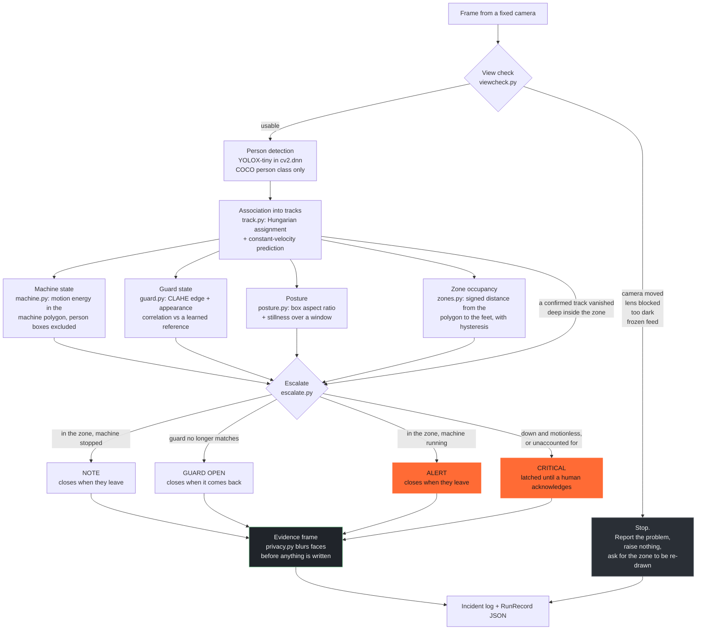
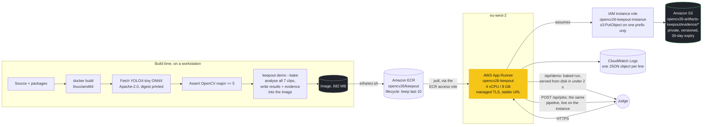

# Architecture

Two diagrams: what happens to a frame, and what runs on AWS.

---

## 1. The vision pipeline

Every frame goes through the same seven steps, in this order, and the order is the
design. The view check is first because nothing below it means anything if the
camera has moved.



### Why the order matters

**The view check is first**, and it is the only step that can stop the pipeline.
A danger zone is a polygon in the pixel coordinates of one reference frame. Nudge
the camera and that polygon is a statement about a different piece of floor, but
the zone monitor carries on happily reporting "nobody in the zone". Silence that
looks like safety is the worst output this system has, so a frame that fails the
view check produces a named problem and no incidents at all.

We deliberately do not warp the zone into the new view. Fitting a homography to a
scene that has partly changed is exactly the silently-confident-nonsense failure
mode we are trying to avoid. A human re-draws it.

**Detection feeds everything else**, including the two checks that need to know
where people are in order to ignore them:

- machine motion energy excludes the person boxes, because otherwise a worker
  walking past a stopped machine makes it read as running, precisely when somebody
  is next to it;
- the guard check excludes them too, because otherwise anybody standing in front
  of a guard reads as a removed guard, and that alert gets switched off in a week.

**The vanish edge into escalation** is the one that is easy to miss. It is there
because YOLOX-tiny stops returning a box past about 50 degrees of body rotation,
so a person on the floor often produces no detection at all and posture can never
fire. A confirmed track that was standing well inside the zone and then stops
being detected, without crossing the boundary, is escalated on its own. See
`docs/evaluation.md` §5.

---

## 2. The escalation state machine

```mermaid
stateDiagram-v2
    [*] --> Clear

    Clear --> Note: person in the zone,<br/>machine stopped
    Clear --> Alert: person in the zone,<br/>machine running
    Clear --> GuardOpen: guard stops matching<br/>its reference

    Note --> Alert: the machine starts<br/>(upgrades in place,<br/>same incident)
    Note --> Clear: they leave

    Alert --> Clear: they leave
    GuardOpen --> Clear: the guard comes back

    Note --> Critical: down and motionless,<br/>or unaccounted for
    Alert --> Critical: down and motionless,<br/>or unaccounted for
    Clear --> Critical: unaccounted for

    Critical --> Acknowledged: a human presses<br/>acknowledge
    Acknowledged --> [*]

    note right of Critical
        Latched. The condition
        ending does not clear it.
        Only a person does, and
        the acknowledgement is
        recorded with its time.
    end note

    note right of Note
        Incidents upgrade in place
        and never downgrade, so one
        continuous presence is one
        story with one set of
        evidence frames.
    end note
```

---

## 3. AWS



### What each piece is for

| Component | Why |
|---|---|
| **ECR** | Private image registry in the same region as the service. App Runner cannot pull cross-region. Lifecycle policy keeps the last ten images. |
| **App Runner** | A managed HTTPS URL with no load balancer. An ALB would cost about $16.20/month at zero traffic; App Runner's URL is included. There is no arm64 runtime, which is why the image is `linux/amd64`. |
| **IAM instance role** | Scoped to `s3:PutObject` on `keepout/evidence/*` and nothing else. The service never reads, lists or deletes. Created by `products/keepout/infra/instance-role.sh` because the shared `infra/apprunner.sh` only creates the ECR *access* role. |
| **S3** | Evidence frames that outlive the container. Private, versioned, encrypted, 30-day expiry. Failures are non-fatal and circuit-broken: evidence is already on local disk and served by the API. |
| **CloudWatch Logs** | App Runner ingests stdout. `servicekit` writes one JSON object per line with a request id, so there is no logging agent and no log files. |

### State, and the lack of it

The service holds jobs in memory, with a TTL and an eviction cap. That is a
deliberate limit, not an oversight: a restart loses in-flight jobs and their
acknowledgements. The baked runs are read-only files in the image, so they always
come back. A real deployment that needed acknowledgements to survive a restart
would write incidents to DynamoDB, and the shape of the `RunRecord` is already the
right shape for that.

### The region

The service is in **eu-west-2**, not `us-east-1` as originally planned, because
this AWS account is restricted to two App Runner services per region and both
`us-east-1` slots hold unrelated live services. The ECR repository was created in
`eu-west-2` to match, since App Runner cannot pull across regions. The S3 bucket
stays in `us-east-1` and the container is given `AWS_REGION=us-east-1` so its S3
client targets the right endpoint. Everything is tagged `Project=opencv26`.
